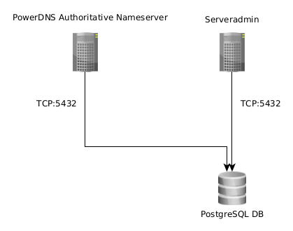

Extensions
==========

PowerDNS
--------

*Serveradmin PowerDNS extension is optional and not enabled by default.*

PowerDNS is an authoritative nameserver and recursor with different (SQL)
backends.

See `PowerDNS Homepage <https://www.powerdns.com/>`_

What it is
^^^^^^^^^^

PowerDNS extension can be used to manage DNS domains and records in
Serveradmin and synchronise them to a PowerDNS authoritative nameserver with a
PostgreSQL database backend.

This allows to manage DNS information for your hosts from the Serveradmin
Servershell and Remote API (and it's benefits such as authentication and
authorisation).

How to use it
^^^^^^^^^^^^^

PowerDNS Authoritative Nameserver
"""""""""""""""""""""""""""""""""

To use the PowerDNS extension you must have a running PowerDNS authoritative
nameserver with a PostgreSQL backend.

See `Installing PowerDNS <https://doc.powerdns.com/authoritative/installation.html>`_
and `Generic PostgreSQL backend <https://doc.powerdns.com/authoritative/backends/generic-postgresql.html>`_

Note that Serveradmin does not manage the PowerDNS database schema!

A simple setup could look like this:

Depending on your needs for scalability, performance and redundancy your
setup might look different.

Django Database Settings
""""""""""""""""""""""""

To advertise PowerDNS PostgreSQL backend to Serveradmin add the *pdns*
connection via .env file, environment variables or settings.py::

    DATABASES = {
        # Serveradmin database connection
        'default': {},
        # Optional PowerDNS database connection
        'pdns': {
            'ENGINE': 'django.db.backends.postgresql',
            'NAME': env('POSTGRES_PDNS_DB', default=None),
            'USER': env('POSTGRES_PDNS_USER', default=None),
            'PASSWORD': env('POSTGRES_PDNS_PASSWORD', default=None),
            'HOST': env('POSTGRES_PDNS_HOST', default=None),
            'PORT': env('POSTGRES_PDNS_PORT', default=5432),
            'OPTIONS': {
                'client_encoding': 'UTF8',
            },
        },
    }

The user role must have at least the privileges

* SELECT
* INSERT
* UPDATE
* DELETE
* CONNECT

See `PostgreSQL Privileges <https://www.postgresql.org/docs/current/ddl-priv.html>`_

